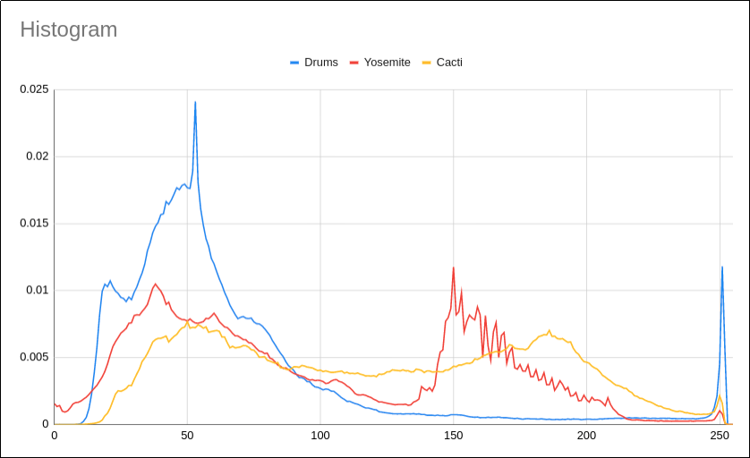

# Problem Set 2 - ECE391 Spring 2020

### Logistics
Problem Set 2 is due **Monday 2/17 at 11:59:59 PM** in the master branch. Only
one person per group should have a `partners.txt` with **all** the netids of
your partners on separate lines **including your own**; However, if you would
like to attempt it on your own for practice, leave your `partners.txt` empty
and the autograder will still run but will not commit your score to the
database.

Note that if your netid is part of more than one `partners.txt`, you will
recieve a 0 for the problem set.

### Problem 1: Reading VGA Documentation (6 pt)
As preparation for MP2, you need to figure out how to do a couple of things
with the VGA.  There's some free documentation available
[here](www.osdever.net/FreeVGA/vga/vga.htm), but you may use any documentation
that you like to learn the necessary changes to registers and so forth.  Write
your solution in p1/solution.md (Note this is a markdown file so you can use
markdown formatting if you like)

1. You must use VGA support to add a non-scrolling status bar. Figure out how
to use VGA registers to separate the screen into two distinct regions. Explain
the necessary register value settings, how the VGA acts upon them, and any
relevant constraints that must be obeyed when setting up the status bar.
2. You must change the VGA's color palette. Figure out how to do so, and
explain the sequence of register operations necessary to set a given color to a
given 18-bit RGB (red, green, blue) value.

### Problem 2: Tux Driver Code/Documentation (9 pt)
As part of MP2, you will also write a device driver for the Tux controller
boards in the lab. The documentation for this board can be found in the file
*mtcp.h* in the class directory under mp2.  You will need to read it for the
following questions.  Write your solution in p2/solution.md (Note this is a
markdown file so you can use markdown formatting if you like)

1. For each of the following messages sent from the computer to the Tux
controller, briefly explain when it should be sent, what effect it has on the
device, and what message or messages are returned to the computer as a result:
**MTCP\_BIOC\_ON**, **MTCP\_LED\_SET**.
2. For each of the following messages sent from the Tux controller to the
computer, briefly explain when the device sends the message and what
information is conveyed by the message: **MTCP\_ACK**, **MTCP\_BIOC\_EVENT**,
**MTCP\_RESET**.
3. Now read the function header for **tuxctl\_handle\_packet** in
**tuxctl-ioctl.c**---you will have to follow the pointer there to answer the
question, too. In some cases, you may want to send a message to the Tux
controller in response to a message just received by the computer (using
**tuxctl\_ldisc\_put**). However, if the output buffer for the device is full,
you cannot do so immediately. Nor can the code (executing in
**tuxctl\_handle\_packet**) wait (for example, go to sleep).  Explain in one
sentence why the code cannot wait.

### Problem 3: Parallel Histogram (10 pt)
**You must attempt this problem on Linux EWS.** If you attempt this problem on
the class VM you will not see any of the adverse effects of concurrently
running *threads* accessing shared data without synchronization because it is a
uniprocessor system.

Congratulations you have just been hired as a summer intern at Brick, a company
widely known for having the best cloud based creative tools.  You have been
tasked with making a histogramming tool for their popular product PhotoMarket.
A histogram algorithm loops over input data (in this case an 8 bit greyscale
image) and assigns each element to a histogram bin.  Histograms are important
to photographers because they can analyze the distribution of the pixels, and
help a photographer understand if the photo is over or under exposed based on
the distributions shape.  Included in the P3 folder are 3 photos of different
subject matter and their histograms have been plotted below.

However the sequential histogramming operation is O(N^2) so with better camera
quality the company determined it needed to parallelize the algorithm to
improve the user experience.  You have written the parallel algorithm however
you notice that for some thread and bin size combinations the results do not
match the sequential implementation (for example: threads=16 and bins=10).
After spending some time thinking about the cause of the inconsistencies you
remember that shared data accessed by multiple threads concurrently can lead to
**Data Races**.  Your job is to add the proper synchronization primitives to
the parallel histogram implementation in *histogram.c* (Note you should **only
make your changes in this histogram.c**) so that the parallel histogram
algorithm is safe from data races.

1. Identify the shared data between the threads
2. Determine where to add synchronization primitives to protect the shared 
data.
3. You should make your critical section as short as possible as to not block 
other threads for too long.

Hint: You should use a pthread mutex from
[libpthreads](https://pubs.opengroup.org/onlinepubs/009695399/functions/pthread_mutex_lock.html)

To build the code (no debug flag):
`$ make clean && make`

To run the code:
`$ ./hist 16 10 ./drums.jpg`

To build the code (debug flag):
`$ make clean && make debug`

To run the code (debug):
`$ gdb --args ./hist 16 10 ./drums.jpg`
